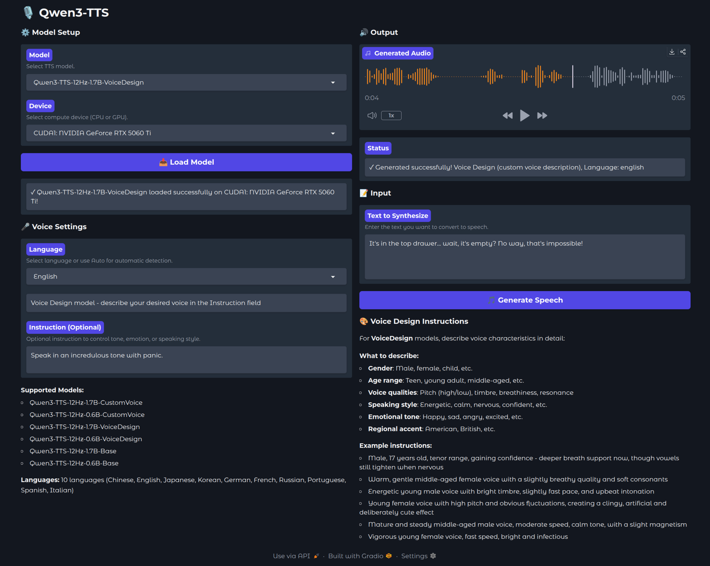

# 🎙️ Qwen3-TTS Gradio Web UI

Gradio web interface for [Qwen3-TTS](https://github.com/QwenLM/Qwen3-TTS) text-to-speech models with custom voice control.



## Features

- **Multi-language Support**: 10 languages including Chinese, English, Japanese, Korean, German, French, Russian, Portuguese, Spanish, and Italian
- **Custom Voice Control**: Control tone, emotion, and speaking style with natural language instructions for pre-defined speakers
- **Voice Design**: Create custom voices using natural language descriptions (gender, age, voice qualities, emotional tone)
- **Voice Clone**: Clone voices from reference audio clips
- **Flexible Deployment**: Run on CPU or GPU with automatic device detection

## Custom Voice Profiles (CustomVoice Models)

| Speaker | Description | Native Language |
|---------|-------------|-----------------|
| Vivian | Bright, slightly edgy young female voice | Chinese |
| Serena | Warm, gentle young female voice | Chinese |
| Uncle Fu | Seasoned male voice with low, mellow timbre | Chinese |
| Dylan | Youthful Beijing male voice, clear & natural | Chinese (Beijing Dialect) |
| Eric | Lively Chengdu male voice, slightly husky & bright | Chinese (Sichuan Dialect) |
| Ryan | Dynamic male voice with strong rhythmic drive | English |
| Aiden | Sunny American male voice with clear midrange | English |
| Ono Anna | Playful Japanese female voice, light & nimble | Japanese |
| Sohee | Warm Korean female voice with rich emotion | Korean |

## Supported Models

### CustomVoice Models (Pre-defined Voice Profiles)
- **Qwen3-TTS-12Hz-1.7B-CustomVoice**: Full-featured model with 9 pre-defined voice profiles
- **Qwen3-TTS-12Hz-0.6B-CustomVoice**: Lightweight model with 9 pre-defined voice profiles

### VoiceDesign Models (Custom Voice Creation)
- **Qwen3-TTS-12Hz-1.7B-VoiceDesign**: Create custom voices with natural language descriptions
- **Qwen3-TTS-12Hz-0.6B-VoiceDesign**: Lightweight custom voice creation

### Base Models (Voice Clone)
- **Qwen3-TTS-12Hz-1.7B-Base**: Voice cloning from reference audio
- **Qwen3-TTS-12Hz-0.6B-Base**: Lightweight voice cloning


## Getting Models

### Manual Download

If you prefer manual download, each model is available on Hugging Face:

- [Qwen3-TTS-12Hz-1.7B-CustomVoice](https://huggingface.co/Qwen/Qwen3-TTS-12Hz-1.7B-CustomVoice)
- [Qwen3-TTS-12Hz-0.6B-CustomVoice](https://huggingface.co/Qwen/Qwen3-TTS-12Hz-0.6B-CustomVoice)
- [Qwen3-TTS-12Hz-1.7B-VoiceDesign](https://huggingface.co/Qwen/Qwen3-TTS-12Hz-1.7B-VoiceDesign)
- [Qwen3-TTS-12Hz-0.6B-VoiceDesign](https://huggingface.co/Qwen/Qwen3-TTS-12Hz-0.6B-VoiceDesign)
- [Qwen3-TTS-12Hz-1.7B-Base](https://huggingface.co/Qwen/Qwen3-TTS-12Hz-1.7B-Base)
- [Qwen3-TTS-12Hz-0.6B-Base](https://huggingface.co/Qwen/Qwen3-TTS-12Hz-0.6B-Base)

### Clone Models with Git LFS

Before cloning, make sure [Git LFS](https://git-lfs.com) is installed:

```bash
# Install Git LFS
sudo apt-get install git-lfs  # Debian/Ubuntu
# Initialize Git LFS (run once on your system)
git lfs install
```

### CustomVoice Models (Pre-defined Voice Profiles)
```bash
git clone https://huggingface.co/Qwen/Qwen3-TTS-12Hz-1.7B-CustomVoice
git clone https://huggingface.co/Qwen/Qwen3-TTS-12Hz-0.6B-CustomVoice
```

### VoiceDesign Models (Custom Voice Creation)
```bash
git clone https://huggingface.co/Qwen/Qwen3-TTS-12Hz-1.7B-VoiceDesign
git clone https://huggingface.co/Qwen/Qwen3-TTS-12Hz-0.6B-VoiceDesign
```

### Base Models (Voice Clone)
```bash
git clone https://huggingface.co/Qwen/Qwen3-TTS-12Hz-1.7B-Base
git clone https://huggingface.co/Qwen/Qwen3-TTS-12Hz-0.6B-Base
```

> **Note**: After downloading, ensure models are placed in a directory that will be mounted to `/models` in the container. Don't forget to check and update the volume mapping in `docker-compose.yml` to match where you downloaded the models.

## Quick Start

### Using Docker Compose

1. **Download models**: Download your desired Qwen3-TTS models (see [Getting Models](#getting-models) section above) and update the volume path in `docker-compose.yml` to point to your model directory.

2. **Build and run the service**:
```bash
docker-compose up -d --build
```

3. **Access the interface**: Open `http://localhost:7861` in your browser

### Using Python

**Requirements**: CUDA 12.8, Ubuntu 24.04 (or compatible)

1. **Install system dependencies**:
```bash
apt-get update && apt-get install -y build-essential libsndfile1 sox
```

2. **Create virtual environment** (recommended):
```bash
python3 -m venv venv
source venv/bin/activate
```

3. **Install dependencies**:
```bash
pip install torch torchaudio --extra-index-url https://download.pytorch.org/whl/cu128
pip install flash-attn --no-build-isolation
pip install gradio soundfile qwen-tts
```

2. **Run the app**:
```bash
python3 app.py
```

3. **Access the interface**: Open `http://localhost:7860`

## Usage

### CustomVoice Models (Pre-defined Speakers)

1. **Load Model**: Select a CustomVoice model and device (CPU/GPU), then click "Load Model"
2. **Choose Speaker**: Select from 9 pre-defined voice profiles
3. **Select Language**: Choose language or use Auto for automatic detection
4. **Add Instructions** (Optional): Modify tone/emotion, e.g.:
   - "Speak in an angry tone"
   - "Speak in a cute, childish tone"
   - "Very happy"
   - "Speak in an incredulous tone with panic"
5. **Generate Speech**: Enter your text and click "Generate Speech"

### VoiceDesign Models (Custom Voices)

1. **Load Model**: Select a VoiceDesign model and device, then click "Load Model"
2. **Select Language**: Choose language or Auto
3. **Describe Voice**: In the Instruction field, describe your desired voice:
   - **Gender/Age**: Male, female, child, teen, middle-aged, etc.
   - **Voice Qualities**: Pitch (high/low), timbre, breathiness, resonance
   - **Speaking Style**: Energetic, calm, nervous, confident, etc.
   - **Emotional Tone**: Happy, sad, angry, excited, etc.
   
   Example: "Warm, gentle middle-aged female voice with a slightly breathy quality"
4. **Generate Speech**: Enter your text and click "Generate Speech"

### Base Models (Voice Clone)

1. **Load Model**: Select a Base model and device, then click "Load Model"
2. **Upload Reference Audio**: Upload a 3+ second audio clip of the voice you want to clone
3. **Enter Reference Text**: Provide the transcript of the reference audio
4. **Select Language**: Choose language or Auto
5. **Generate Speech**: Enter your text and click "Generate Speech"

## Tips

- Use the speaker's native language for optimal quality
- Instructions can be in any language supported by the model
- Select "Auto" for language to let the model detect the input language automatically
- GPU support significantly reduces generation latency

## Configuration

### Environment Variables

- `MODELS_BASE_DIR`: Base directory for model files (default: `/models`)
